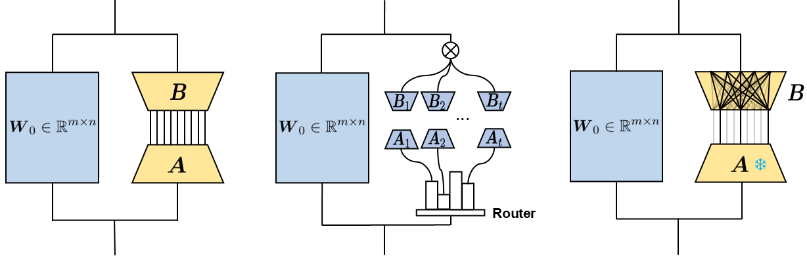

# FlyLoRA: Boosting Task Decoupling and Parameter Efficiency via Implicit Rank-Wise Mixture-of-Experts

This repository contains the official implementation of our NeurIPS 2025 paper:
**"FlyLoRA: Boosting Task Decoupling and Parameter Efficiency via Implicit Rank-Wise Mixture-of-Experts."**

Our implementation is built upon the [PEFT](https://github.com/huggingface/peft) library. Modified source files are mainly primarily located in:
- `src/peft/tuners/lora/layer.py`
- `src/peft/tuners/lora/bnb.py`
- `src/peft/tuners/lora/config.py`

All changes are marked with `# modified`.



## 🧠 Abstract

Low-Rank Adaptation (LoRA) is a widely used parameter-efficient fine-tuning method for foundation models, but it suffers from parameter interference, resulting in suboptimal performance. Although Mixture-of-Experts (MoE)-based LoRA variants show promise in mitigating intra-task correlations in single-task instruction tuning, they introduce additional router parameters and remain ineffective in multi-task model merging where inter-task interference arises. Inspired by the fly olfactory circuit, we propose FlyLoRA, an implicit MoE-based LoRA variant that introduces: (1) rank-wise expert activation in the up-projection matrix, and (2) an implicit router that unifies expert routing and down-projection, where a frozen sparse random projection matrix replaces the traditional dense trainable version. This design resolves the trade-off between intra-task decorrelation and computational efficiency by eliminating the need for an explicit router, while inherently mitigating inter-task interference due to the orthogonality property of random matrices. Extensive experiments across four domains---general knowledge understanding, scientific question answering, mathematical reasoning, and code generation---demonstrate consistent performance improvements over existing methods. Beyond empirical gains, FlyLoRA highlights how biological structures can inspire innovations in AI technologies.

## 🧩 Minimal Implementation

For reference, we provide a minimal implementation of **FlyLoRA** in `flylora.py`. This simplified version captures the core idea of *implicit rank-wise mixture-of-experts* using a frozen sparse random projection and top-k rank activation.

## ⚙️ Environment Setup

We recommend using Miniconda to create a clean environment:

```bash
conda create -n FlyLoRA python=3.9
conda activate FlyLoRA
pip install -r requirements.txt
cd peft
pip install -e ".[dev]"
```

## 🚀 Running Experiments

We provide example scripts for single-task training, evaluation, and model merging using Llama-3.1-8B on the MMLU benchmark.
```bash
cd scripts
./run_mmlu.sh         # single-task training and evaluation
./run_merge_lora.sh   # multi-task model merging
```

## 📖 Citation

If you find this repository useful, please consider citing our paper:

```bibtex
@inproceedings{zou2025flylora,
    title={FlyLoRA: Boosting Task Decoupling and Parameter Efficiency via Implicit Rank-Wise Mixture-of-Experts},
    author={Zou, Heming and Zang, Yunliang and Xu, Wutong and Zhu, Yao and Ji, Xiangyang},
    journal={Advances in Neural Information Processing Systems},
    year={2025}
}
```

## 📬 Contact

If you have any questions or feedback, please feel free to reach out:  
📧 [zouhm24@mails.tsinghua.edu.cn](mailto:zouhm24@mails.tsinghua.edu.cn)